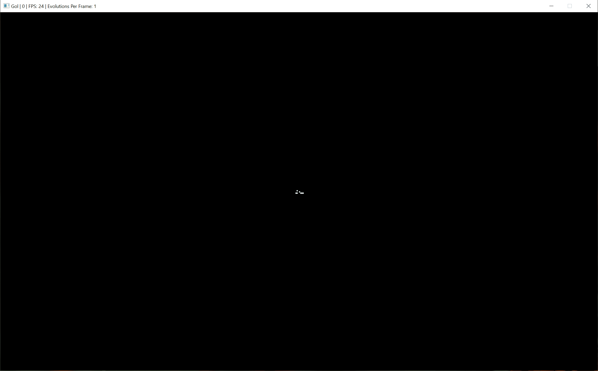

# Rust Game of Life

This is a simulator of Conway's Game of Life in Rust, using SDL2 to render the game graphically. It was built as a Rust learning exercise.



Much of this code is inspired by [Ivan Yakushev's rust.game_of_life](https://github.com/iyakushev/rust.game_of_life).

## Build/Running

To build from the source:

1. Clone this repository.
2. Run `cargo build --release`. This requires a C compiler to build and link SDL2 libraries; install the recommended C compiler if the build fails.
   - *Note:* you can also use `cargo run`, but building in the release configuration is recommended for performance.
3. Run the `conway` executable generated in the `target/release` folder. See below for examples.

### Examples

```
# See all CLI options
.\target\release\conway.exe --help

# Run a random simulation with 450 rows and 600 columns of 2x2 cells.
.\target\release\conway.exe -d 450x600 -c 2

# Run a simulation with the starting pattern in `games/gosper.txt`.
.\target\release\conway.exe -d 100x200 -f games/gosper.txt
```

## Starting and controlling the simulation

The simulation can be initiated using a command line tool with basic options for configuring the intial pattern and how the game is displayed. The simulation can be controlled using keyboard input:

- The **spacebar** causes the game to play/pause.
- The **n** key single-steps the game when rendering is paused.
- The **up/down arrows** increase/decrease the max framerate of the rendering. Depending on the size/complexity of the game being rendered, the actual framerate may fall below this. When the framerate is set to *max*, the program will attempt to render as fast as it possibly can.
- The **right/left arrows** increase/decrease the number of evolutions the game steps through per frame. Setting this to a high value will significantly impact performance.
- **Q** or **Escape** ends the simulation.

## Game files

The simulation can be configured to start from a predetermined pattern by passing a path to a pattern file (just a normal text file following a specific syntax). The pattern files can be in one of two formats: *chars* or *coords*. Some example files are found in the `games` directory.

### Chars format

The chars format is a visual pattern representation that uses characters to represent dead or alive cells. The first line of the file must be `chars`:

```
chars
```

Then the characters representing dead and live cells are given in curly braces (`{<dead><live>}`):

```
{.#}
```

Finally, the pattern is written by placing dead or live characters in their place visually:

```
........................#...........
......................#.#...........
............##......##............##
...........#...#....##............##
##........#.....#...##..............
##........#...#.##....#.#...........
..........#.....#.......#...........
...........#...#....................
............##......................
```

Note that it is not necessary to pad each row with dead cells. The following is equivalent to the above:

```
........................#
......................#.#
............##......##............##
...........#...#....##............##
##........#.....#...##
##........#...#.##....#.#
..........#.....#.......#
...........#...#
............##
```

The complete chars pattern file looks like:

```
chars

{.#}

........................#...........
......................#.#...........
............##......##............##
...........#...#....##............##
##........#.....#...##..............
##........#...#.##....#.#...........
..........#.....#.......#...........
...........#...#....................
............##......................
```

### Coords format

The coords format gives a list of live cells as `row,col` coordinates. A coords pattern file looks like this:

```
coords

0,1
1,3
2,0
2,1
2,4
2,5
2,6
```

Each line has an individual coordinate made of nonnegative integers. The above is equivalent to the following char pattern:

```
chars

{.#}

.#.....
...#...
##..###
```
